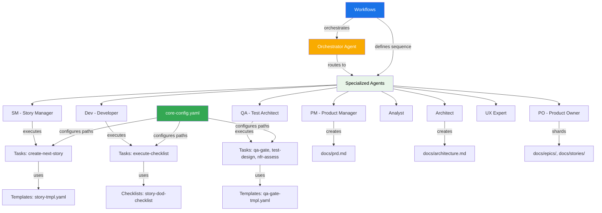

# AGENTS.md
This file provides guidance to Verdent when working with code in this repository.

## Table of Contents
1. Commonly Used Commands
2. High-Level Architecture & Structure
3. Key Rules & Constraints
4. Development Hints

## Commands

This is a **documentation-only repository** with no build, test, or compilation processes. It contains the BMad Method framework configuration and documentation.

**Core workflow commands** (executed by AI agents in target projects):
- `*help` - Display available commands for current agent
- `*agent {name}` - Switch to specialized agent (via Orchestrator)
- `*draft` - Create next story (SM agent)
- `*develop-story {story}` - Implement story (Dev agent)
- `*review {story}` - Quality gate review (QA agent)
- `*shard-doc {document}` - Split large documents into sharded sections
- `*task {task-name}` - Execute specific task from tasks/ directory
- `*execute-checklist {checklist}` - Validate against quality checklist

**Configuration management:**
- Installation configured via `install-manifest.yaml` (v4.44.3)
- Core settings in `core-config.yaml`
- Workflows defined in `workflows/` directory

**No traditional development commands** - this repo contains templates, workflows, and agent definitions to be loaded into AI agents working on *other* projects.

## Architecture

### Major Subsystems & Responsibilities

| Subsystem | Location | Purpose |
|-----------|----------|---------|
| **Agents** | `agents/` | AI agent role definitions (10 specialized agents: Master, Orchestrator, SM, Dev, QA, PM, PO, Analyst, Architect, UX Expert) |
| **Workflows** | `workflows/` | Process orchestration for greenfield/brownfield projects (fullstack, service, UI variants) |
| **Tasks** | `tasks/` | Executable procedures (23 tasks: story creation, documentation, QA, elicitation, etc.) |
| **Templates** | `templates/` | YAML output templates for PRDs, architecture docs, stories, QA gates |
| **Checklists** | `checklists/` | Quality validation criteria (6 checklists: story DoD, architect review, PM validation, etc.) |
| **Agent Teams** | `agent-teams/` | Pre-configured team compositions (fullstack, minimal, no-UI, all agents) |
| **Knowledge Base** | `data/` | Reference materials (testing frameworks, elicitation methods, technical preferences) |
| **Utilities** | `utils/` | Workflow management guides and document templates |

### Key Data Flows

#### Planning Phase (Web UI → IDE Transition)
```
Analyst (brainstorm/research) 
  → PM (create PRD) 
  → UX Expert (optional front-end spec) 
  → Architect (create architecture.md)
  → PO (validate alignment, shard documents)
  → Ready for development
```

#### Development Cycle (IDE - Repeating Loop)
```
SM (create story from sharded epic)
  → Story approval
  → Dev (implement story tasks)
  → QA (review & quality gate)
  → Dev (address QA findings if needed)
  → Story completion
  → Repeat for next story
```

### External Dependencies

- **AI Agent Platforms**: Designed for Cursor IDE, Claude, ChatGPT, Gemini (any agentic IDE or web UI)
- **Project Configuration**: Relies on target project having standard doc structure (`docs/prd.md`, `docs/architecture.md`, `docs/stories/`, `docs/qa/`)
- **Markdown Exploder Tool** [inferred]: Optional `md-tree` tool for automated document sharding (referenced in core-config.yaml)

### Development Entry Points

**For BMad Method users** (working on their projects):
1. **Planning start**: Load Orchestrator agent → `*workflow-guidance` → select greenfield/brownfield workflow
2. **Story creation**: Load SM agent → `*draft` → creates next story from epic
3. **Implementation**: Load Dev agent → `*develop-story {story-file}` → executes tasks
4. **Quality review**: Load QA agent → `*review {story-file}` → generates gate decision

**For BMad Method maintainers** (this repo):
- Core configuration: `core-config.yaml` (paths, locations, settings)
- Installation tracking: `install-manifest.yaml` (version, file hashes)
- Agent definitions: `agents/*.md` (role behaviors, commands, constraints)
- Workflow sequences: `workflows/*.yaml` (step orchestration)

### Subsystem Relationships



## Key Rules & Constraints

### Project Structure Requirements

**Standard document locations** (configured in `core-config.yaml`):
- PRD: `docs/prd.md` → Shards to `docs/prd/`
- Architecture: `docs/architecture.md` → Shards to `docs/architecture/`
- Stories: `docs/stories/{epic}.{story}.story.md`
- Epics: Pattern `epic-{n}*.md` in sharded PRD location
- QA Assessments: `docs/qa/assessments/`
- QA Gates: `docs/qa/gates/`

**Always-loaded files for Dev agent**:
- `docs/architecture/coding-standards.md`
- `docs/architecture/tech-stack.md`
- `docs/architecture/source-tree.md`

### Workflow Constraints

**Agent specialization** - Each agent has strict role boundaries:
- SM creates/validates stories only (cannot implement)
- Dev implements approved stories only (cannot modify requirements)
- QA provides advisory quality gates only (guides, does not block)
- Agents operate in **clean chat contexts** (new conversation per agent)

**Story lifecycle states**:
1. `Draft` - Created by SM, awaiting approval
2. `Approved` - Ready for Dev implementation
3. `In Progress` - Dev is implementing
4. `Ready for Review` - Implementation complete, awaiting QA
5. `Complete` - QA passed, story done

**Critical workflow rules**:
- Dev agent CANNOT begin implementation until story status is `Approved`
- Dev agent can ONLY modify story file's "Dev Agent Record" section
- QA agent can ONLY modify story file's "QA Results" section
- Document sharding is REQUIRED before starting SM/Dev cycles
- One story at a time (sequential, not parallel)

### Brownfield vs Greenfield Decision Points

**Use brownfield workflows when**:
- Enhancing existing codebase
- Small scope (1-3 stories or <4 hours)
- Minimal architectural changes
- Existing documentation adequate

**Use greenfield workflows when**:
- Building from scratch
- Complex features requiring full planning
- Enterprise applications
- Significant architecture needed

**Early exit routes** (brownfield only):
- Single story → `brownfield-create-story` task
- Small epic (1-3 stories) → `brownfield-create-epic` task
- Major enhancement → Full brownfield workflow

### Quality Assurance Requirements

**QA gate decisions** (4 options):
- `PASS` - All criteria met, recommended for merge
- `CONCERNS` - Minor issues, advisory feedback
- `FAIL` - Critical issues, rework required
- `WAIVED` - Known issues accepted with justification

**QA command execution order**:
1. After story approval: `*risk-profile` (complex stories), `*test-design` (guide dev)
2. During development: `*trace-requirements` (verify coverage), `*nfr-assess` (quality attributes)
3. After development: `*review` (comprehensive assessment) - **REQUIRED**
4. Post-review: `*qa-gate` (update decision if needed)

### Installation & Configuration

- Version tracking via `install-manifest.yaml` (current: v4.44.3)
- IDE setup tracked: `ides_setup: [cursor]`
- Slash command prefix: `BMad` (configurable in `core-config.yaml`)
- Markdown exploder enabled: `markdownExploder: true`
- File integrity verified via SHA hashes in manifest

## Development Hints

### Adding a New Agent

1. Create agent definition file: `agents/{agent-name}.md`
2. Define role, commands, responsibilities, and constraints
3. Add agent to relevant team compositions in `agent-teams/`
4. Reference agent in workflows where needed (`workflows/*.yaml`)
5. Update `install-manifest.yaml` with new file entry
6. Document agent in user guides if user-facing

### Modifying Workflows

**Workflow structure** (YAML format):
```yaml
name: "Workflow Name"
description: "Purpose"
type: "greenfield|brownfield"
phases:
  - name: "Phase Name"
    sequential: true|false
    steps:
      - agent: "agent-name"
        task: "task-name"
        condition: "when to execute"
```

**When editing**:
- Maintain phase dependencies (planning before development)
- Preserve sequential execution where order matters
- Update both greenfield and brownfield variants if logic applies to both
- Test workflow by running through with test project

### Extending Task System

**Task file format** (Markdown):
```markdown
# Task Name

## Purpose
Brief description

## Agent
Which agent executes this

## Inputs
- Required input 1
- Required input 2

## Procedure
Step-by-step instructions

## Outputs
- Expected output 1
- Expected output 2
```

**Adding new task**:
1. Create `tasks/{task-name}.md`
2. Reference task in agent's available commands (`agents/*.md`)
3. Update workflow if task is part of standard flow
4. Add output template if task generates structured files (`templates/*.yaml`)
5. Consider adding quality checklist if validation needed

### Creating Quality Checklists

**Checklist structure** (Markdown with sections):
- Introduction with purpose
- Multiple sections with numbered criteria
- Each criterion: clear pass/fail test
- Optional guidance notes

**Integration**:
- Referenced by `*execute-checklist` command
- Used in workflow validation steps
- Results stored in story files or assessment documents

### Document Sharding Strategy

**When to shard**:
- PRD exceeds ~2000 lines
- Architecture doc exceeds ~1500 lines
- Multiple epics in PRD (shard by epic)
- Complex architecture (shard by component/layer)

**Sharding process**:
1. Identify level 2 headings (`## Section Name`) as shard boundaries
2. Create folder: `docs/{document-name}/`
3. Extract each section to separate file (lowercase-dash-case naming)
4. Create `index.md` with links to all shards
5. Adjust heading levels (## becomes #)

**Manual vs automated**:
- If `md-tree` tool available: Automatic sharding via config
- Otherwise: Use `*shard-doc` task for manual sharding

### Modifying CI/CD Pipeline

**N/A** - This repository has no CI/CD pipeline. It is a documentation and configuration framework.

For target projects using BMad Method:
- CI/CD setup is project-specific
- QA agent validates tests pass before marking stories complete
- Dev agent expected to run linting and tests locally
- Quality gates serve as pre-merge validation checkpoints

### Adding Templates

**Template format** (YAML with placeholder sections):
```yaml
title: "Template Name"
version: "v4"
sections:
  - heading: "Section Name"
    content: "Instructions for what to include"
```

**Process**:
1. Create template: `templates/{name}-tmpl.yaml`
2. Define clear section structure
3. Include examples or guidance in content fields
4. Reference template in tasks that generate this document type
5. Test template by running `*create-doc {template-name}`

### Best Practices for This Repository

- **Maintain version consistency**: Update `install-manifest.yaml` when changing files
- **Keep agents focused**: Each agent has ONE primary responsibility
- **Preserve workflow modularity**: Tasks should be reusable across workflows
- **Document everything**: This is a documentation framework - clarity is critical
- **Test with real projects**: Validate changes by running workflows on sample projects
- **Preserve backward compatibility**: v4 format; breaking changes require version bump
